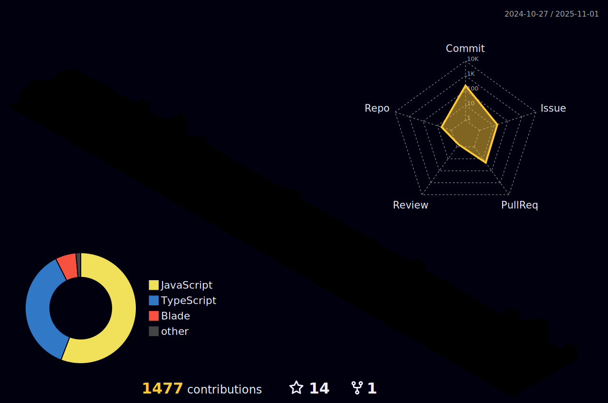

[](https://linkedin.com/in/lugonpedro)
[](mailto:pedrolugonm@gmail.com)
[](https://lugon.dev)


```
👋 Hi, I'm Pedro Lugon
🌎 Living in Brasília - Brazil
💻 Working with Liferay in Simplify Tecnologia
```


  
 | [](https://github.com/vn7n24fzkq/github-profile-summary-cards) | [](https://github.com/vn7n24fzkq/github-profile-summary-cards) |  
 | ----------- | ----------- |


 
  <div align="center" >
<a href="https://skillicons.dev"   >
  
</a>
  <br />

  </div>

 
##
   <div align="center" >
     
  </div>
